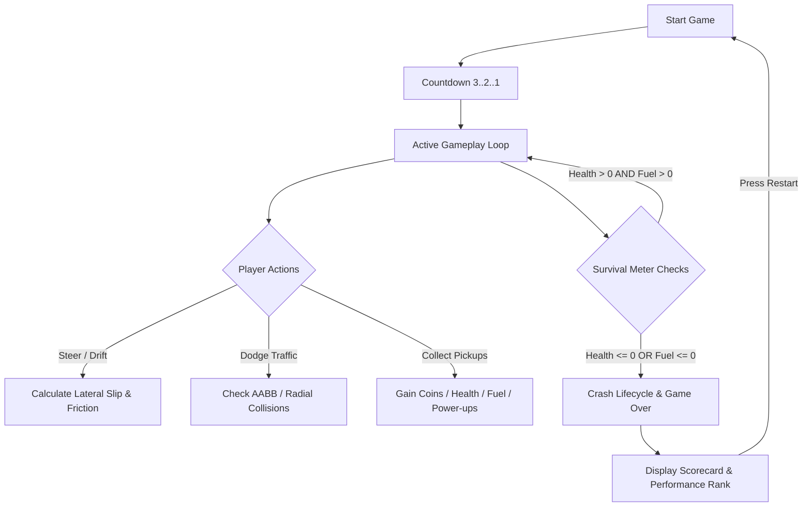

# 🏎️ Mini Drift 3D — Full Project Presentation

A comprehensive presentation covering the technical stack, working methodology, core game concepts, procedural level progression, and rewards system for **Mini Drift 3D**.

---

## 📋 Executive Summary Slide

| Topic | Description | Key Highlights |
| :--- | :--- | :--- |
| **Frameworks** | WebGL & Modern Web Tooling | Three.js, Vite, Tailwind CSS, Web Audio API |
| **Concept** | Arcade Endless 3D Drifter | Real-time vehicle physics, object pooling, finite state machine |
| **Level System** | Dynamic Distance Scaling | 4 Progressive Zones (0m to 2000m+), Checkpoints every 250m |
| **Rewards** | Multipliers, Pickups & Ranks | 2.2x Drift Multiplier, 5 Power-ups, S to D Performance Ranks |

---

## 📊 SLIDE 1: Frameworks We Are Working With & How We Work With Them

We utilize a modern, zero-asset, high-performance web tech stack designed for 60 FPS 3D rendering directly in the browser   without external weight.

```
+-----------------------------------------------------------------------+
|                         MINI DRIFT 3D STACK                           |
+-----------------------------------+-----------------------------------+
|  Three.js (WebGL 3D Engine)       |  Vite (Dev Server & Bundler)      |
|  - Scene graph & renderer          |  - Instant HMR                    |
|  - Custom low-poly geometries     |  - Tree-shaking ESM build         |
+-----------------------------------+-----------------------------------+
|  Tailwind CSS (UI Overlay)        |  Web Audio API (Procedural Audio) |
|  - Glassmorphism dynamic HUD      |  - 0-asset noise & oscillator FX  |
|  - Responsive touch controls      |  - Low latency real-time synthesis|
+-----------------------------------+-----------------------------------+
```

### 1. Three.js (WebGL 3D Engine)
- **What it is**: The core 3D rendering engine used to handle scenegraph transforms, low-poly mesh generation, material shaders, dynamic lights, fog, and shadow mapping.
- **How we work with it**:
  - **Renderer Optimization**: `THREE.WebGLRenderer` configured with `antialias: true` and pixel ratio clamped to `Math.min(window.devicePixelRatio, 2)` to protect mobile GPUs from 4K rendering overhead.
  - **Lighting & Shadows**: Combined `HemisphereLight` (sky/ground ambient tint) with a directional tracking light (`DirectionalLight` + `THREE.PCFSoftShadowMap`) that follows the player's car.
  - **Atmospheric Fog**: Exponential fog (`THREE.FogExp2`, color `#0b0f19`, density `0.0115`) seamlessly hides distant road spawning.
  - **Procedural Low-Poly Geometry**: Car body, wheels, road slabs, barriers, traffic cars, coins, and power-up icons are built procedurally using `THREE.BoxGeometry`, `THREE.CylinderGeometry`, and `THREE.MeshStandardMaterial`.

### 2. Vite (Frontend Build Tool & Dev Server)
- **What it is**: Next-generation frontend tooling providing ultra-fast development server with ES-module HMR.
- **How we work with it**:
  - **Instant Feedback**: Module updates render instantly without full page refreshes.
  - **Optimized Production Bundling**: Minifies JavaScript and CSS assets into lightweight, tree-shaken static bundles.

### 3. Tailwind CSS & Glassmorphism UI
- **What it is**: Utility-first CSS framework powering the user interface overlay layer (`index.html`).
- **How we work with it**:
  - **HUD Overlay**: Real-time stats header showing Speedometer, Distance, High Score, Coins, Health (100 HP bar), and Fuel (100% bar).
  - **Glassmorphism Cards**: Screens (`Start`, `Pause`, `Game Over Scorecard`) styled with `backdrop-blur-md`, `bg-slate-950/75`, and `border-slate-800` for a sleek modern aesthetic.
  - **Mobile Touch Controls**: Responsive touch swipe overlays and onscreen steering/drift buttons.

### 4. Web Audio API (Synthesized Audio Architecture)
- **What it is**: Native browser audio synthesis engine replacing traditional `.mp3` or `.wav` sound files.
- **How we work with it**:
  - **Zero Network Latency**: Real-time sound generation using `OscillatorNode`, `GainNode`, `BiquadFilterNode`, and white-noise buffers.
  - **Procedural Engine Revs**: Engine pitch scales dynamically with car speed ratio (`speed / maxSpeed`).
  - **Synthesized Explosions**: White-noise generator + lowpass filter frequency ramp for crash impacts.
  - **Tire Screech & Coin Chimes**: Multi-oscillator tone chirps on coin pick-up and drift engagement.

---

## 🎮 SLIDE 2: Core Game Concept & Architectural Design

Mini Drift 3D is an **arcade endless drifter with survival mechanics**. The player controls a high-performance drift car navigating through dynamic multi-lane traffic while managing **Health** and **Fuel**.



### 1. Game State Machine (FSM)
The engine strictly manages 5 distinct operational states:
1. `START`: Main menu overlay with instructions.
2. `COUNTDOWN`: 3-second ready timer before launch.
3. `PLAYING`: Main physics, spawner, and scoring loop active.
4. `PAUSED`: Freeze-frame loop with pause menu overlay.
5. `GAMEOVER`: Crash explosion burst, camera shake, score calculation, scorecard presentation.

### 2. Physics & Drift Dynamics
- **Framerate-Independent Friction**: Tire lateral friction decays exponentially using `Math.pow(drift ? 0.045 : 0.004, dt)`.
- **Drift Slip Mechanics**: Steering responsiveness increases by `38%` while holding the drift key (`Spacebar` / Touch), triggering side slipping, yaw angle alignment, and tire smoke particles.
- **Visual Chassis Dynamics**: Dynamic body roll into turns, pitch during acceleration/braking, and sine-wave suspension sway (`Math.sin(suspensionTime) * 0.018`).

### 3. Procedural Endless Road
- **Modular Segment Recycling**: Road slabs continuously loop along the negative Z-axis. When a segment moves past the camera (`z > carZ + 25`), it teleports ahead to the front of the road queue.
- **Infinite Driving**: Allows endless driving using fixed static memory without allocating new meshes.

### 4. Garbage-Collection Free Memory Management (`ObjectPool`)
- Dynamic objects (traffic cars, coins, power-ups, smoke particles, crash sparks) use pre-allocated memory pools (`ObjectPool`).
- **`O(1)` Deallocation**: Uses swap-with-last removal (`releaseAt`) instead of `Array.splice()`, ensuring zero Garbage Collection spikes for locked 60 FPS performance.

---

## 📈 SLIDE 3: Level System & Progression Design

Mini Drift 3D does **not** rely on static pre-designed levels. Instead, it utilizes a **Procedural Dynamic Distance-Scaling Level System** that continuously ramps up difficulty as the player travels further down the highway.

```
  Difficulty Factor
      ^
 1.35 |                                                /-- (Legend Zone)
 0.90 |                                    /----------/
 0.60 |                        /----------/
 0.30 |            /----------/
 0.00 +------------+----------+-----------+-----------+-----------> Distance (meters)
      0m          500m       1000m       2000m       3000m+
       [ Zone 1 ]   [ Zone 2 ]  [ Zone 3 ]   [ Zone 4: Extreme ]
```

### 1. Progression Zones Breakdown

| Zone | Distance Range | Difficulty Factor | Obstacle Spawn Rate | Fuel / Health Drain | Traffic Complexity |
| :--- | :--- | :--- | :--- | :--- | :--- |
| **Zone 1: Rookie Highway** | `0m - 500m` | `0.00 - 0.30` | Low | Base drain rate | Single lane obstacles, wide dodge gaps |
| **Zone 2: Speed Highway** | `500m - 1000m` | `0.30 - 0.60` | Medium | +20% fuel drain | Two-lane traffic patterns, moving vehicles |
| **Zone 3: Drift Expressway** | `1000m - 2000m` | `0.60 - 0.90` | High | +40% fuel drain | Multi-lane barricades, fast traffic, rare power-up spawns |
| **Zone 4: Legend Drift Zone** | `2000m+` | `0.90 - 1.35` (Cap) | Maximum | +60% fuel drain | Tightly clustered obstacle weaves & fast moving traffic |

### 2. Checkpoint System
- **Interval**: Checkpoints appear every **250 meters**.
- **Visuals**: Animated low-poly Checkpoint Banner arches across the track.
- **Reward**: Crossing a checkpoint grants a **+100 PTS Bonus** and triggers a celebratory audio chime and HUD notification.

---

## 🎁 SLIDE 4: Rewards, Power-Ups & Performance Ranking System

Mini Drift 3D rewards player skill through score multipliers, interactive field pickups, active power-up abilities, and end-of-run rank evaluation.

### 1. In-Game Pickups & Active Power-Ups

| Icon | Item | Effect | Tactical Value |
| :---: | :--- | :--- | :--- |
| 🪙 | **Coin** | +25 Score (+50 Score if collected while drifting) | Essential for high score grinding |
| 🧲 | **Magnet** | Automatically pulls nearby coins toward vehicle | Synergizes with coin clusters during high-speed drifts |
| ⛽ | **Fuel Canister** | Instantly restores **+35% Fuel** | Prevents game over due to engine starvation |
| ❤️ | **Health Repair** | Instantly restores **+30 HP** | Recovers vehicle from collision damage |
| 🛡️ | **Shield** | Absorbs **1 full collision impact** without damage | Safeguards player against fatal crashes |
| 👻 | **Invisibility (Ghost)** | Phase-through invulnerability for 6 seconds | Allows player to pass cleanly through obstacles |

### 2. Drift Multiplier & Combo System
- **Base Multiplier**: Drifting increases distance score gain by **2.2x** per frame.
- **Drift Combo Meter**: Accumulates continuously while holding a slip angle. Drift coin pickups award a **2x bonus (+50 PTS)**.

### 3. Performance Rank Calculator (End-of-Run Scorecard)
When a run ends, the game calculates a performance rank based on total score and distance driven:

```
                  +-----------------------------------+
                  |      TOTAL SCORE & DISTANCE       |
                  +-----------------+-----------------+
                                    |
          +-------------------------+-------------------------+
          |                         |                         |
   Score >= 4000 OR          Score >= 2000 OR          Score >= 800 OR
   Distance >= 2500m         Distance >= 1200m         Distance >= 600m
          |                         |                         |
          v                         v                         v
+-------------------+     +-------------------+     +-------------------+
| S RANK            |     | A RANK            |     | B RANK            |
| DRIFT LEGEND      |     | PRO DRIVER        |     | SPEED RACER       |
| (Emerald Badge)   |     | (Cyan Badge)      |     | (Amber Badge)     |
+-------------------+     +-------------------+     +-------------------+
          |                         |                         |
          +-------------------------+-------------------------+
                                    |
          +-------------------------+-------------------------+
          |                                                   |
   Score >= 250 OR                                    Score < 250
   Distance >= 200m                                           |
          |                                                   v
          v                                         +-------------------+
+-------------------+                               | D RANK            |
| C RANK            |                               | HIGHWAY WRECK     |
| ROOKIE DRIVER     |                               | (Red Badge)       |
| (Blue Badge)      |                               +-------------------+
+-------------------+
```

### 4. High Score Persistence
- All-time high scores are stored locally via `window.localStorage`.
- Real-time updates notify the player on-screen the instant a new Personal Best is established during active gameplay!

---

## 💡 Summary Checklist for Presentation

1. **Frameworks**: Three.js (WebGL rendering, lighting, procedural meshes), Vite (ESM build & dev server), Tailwind CSS (Glassmorphism HUD & controls), Web Audio API (procedural assetless sound engine).
2. **How We Work With Frameworks**: Clamped pixel ratios, custom object pooling, procedural mesh construction, state machine management, zero external media dependencies.
3. **Concept**: Endless 3D arcade drifter combining drift physics with health/fuel survival strategy.
4. **Level System**: Infinite dynamic distance-based scaling across 4 progression zones with 250m checkpoints.
5. **Rewards**: 6 pickup/power-up types, 2.2x drift scoring multiplier, coin drift bonuses, and S-to-D rank badges saved to persistent local high scores.
