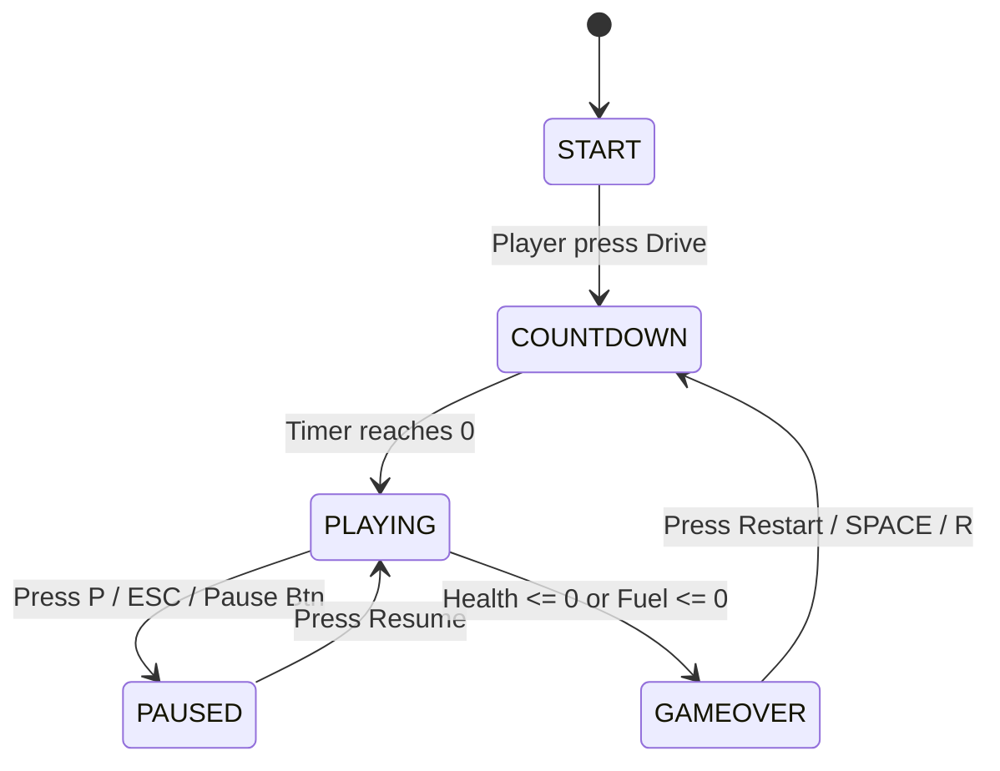

# Mini Drift 3D — Comprehensive Technical Architecture & Concept Documentation

This document provides an in-depth breakdown of the frameworks, concepts, design patterns, vehicle physics, rendering systems, and architectural decisions implemented in **Mini Drift 3D**.

---

## Table of Contents

- [1. Frameworks & Technologies](#1-frameworks--technologies)
  - [1.1 Three.js (WebGL Rendering Engine)](#11-threejs-webgl-rendering-engine)
  - [1.2 Vite (Frontend Build Tool & Dev Server)](#12-vite-frontend-build-tool--dev-server)
  - [1.3 Tailwind CSS & Glassmorphism UI Layer](#13-tailwind-css--glassmorphism-ui-layer)
  - [1.4 Web Audio API (Synthesized Audio Architecture)](#14-web-audio-api-synthesized-audio-architecture)
- [2. Game Engine Architecture & State Machine](#2-game-engine-architecture--state-machine)
  - [2.1 Game Loop & Delta-Time Normalization](#21-game-loop--delta-time-normalization)
  - [2.2 Finite State Machine (FSM)](#22-finite-state-machine-fsm)
- [3. Memory Management & Object Pooling](#3-memory-management--object-pooling)
  - [3.1 ObjectPool Implementation](#31-objectpool-implementation)
- [4. Vehicle Physics & Drift Dynamics](#4-vehicle-physics--drift-dynamics)
  - [4.1 Lateral Velocity & Non-Linear Tire Friction](#41-lateral-velocity--non-linear-tire-friction)
  - [4.2 Chassis Roll, Pitch, and Visual Suspension Sway](#42-chassis-roll-pitch-and-visual-suspension-sway)
- [5. Procedural Endless Environment & Road System](#5-procedural-endless-environment--road-system)
  - [5.1 Infinite Segment Recycling](#51-infinite-segment-recycling)
- [6. Collision Detection System](#6-collision-detection-system)
  - [6.1 Hybrid AABB & Radial Proximity Check](#61-hybrid-aabb--radial-proximity-check)
- [7. Dynamic Follow Camera System](#7-dynamic-follow-camera-system)
  - [7.1 Speed-Based FOV Expansion & Smooth Lerping](#71-speed-based-fov-expansion--smooth-lerping)
- [8. Procedural Web Audio Engine](#8-procedural-web-audio-engine)
  - [8.1 Zero-Asset Audio Synthesis (AudioManager)](#81-zero-asset-audio-synthesis-audiomanager)
- [9. Crash Lifecycle & Scorecard UI System](#9-crash-lifecycle--scorecard-ui-system)
  - [9.1 Flow Sequence & Performance Rank Calculator](#91-flow-sequence--performance-rank-calculator)

---

<a id="1-frameworks--technologies"></a>
## 1. Frameworks & Technologies

<a id="11-threejs-webgl-rendering-engine"></a>
### 1.1 Three.js (WebGL Rendering Engine)
- **Role**: 3D graphics renderer, scene graph manager, lighting, geometry batching, and shadow mapping.
- **Key Features Used**:
  - **`THREE.WebGLRenderer`**: Configured with `antialias: true`, high-performance power preference, and pixel ratio clamping (`Math.min(devicePixelRatio, 2)`).
  - **`THREE.PCFSoftShadowMap`**: Soft shadow map computation for ambient realism.
  - **`THREE.FogExp2`**: Atmospheric exponential fog (`fog color: #0b0f19`, `density: 0.0115`) seamlessly blending the distant road horizon into the dark skybox background.
  - **Hierarchical Scenegraph Groups**: `Car` mesh grouping chassis, cabin, wheels, headlights, tail-lights, and particle systems under transform nodes.

```js
// Justification: Clamping pixel ratio to max 2 prevents 4K mobile displays from rendering 4x unnecessary pixels while maintaining crisp anti-aliased output.
this.renderer = new THREE.WebGLRenderer({
  antialias: true,
  powerPreference: 'high-performance',
});
this.renderer.setPixelRatio(Math.min(window.devicePixelRatio || 1, 2));
this.renderer.shadowMap.enabled = true;
this.renderer.shadowMap.type = THREE.PCFSoftShadowMap;
```

<a id="12-vite-frontend-build-tool--dev-server"></a>
### 1.2 Vite (Frontend Build Tool & Dev Server)
- **Role**: Modern ES-module build engine providing Instant HMR (Hot Module Replacement), fast bundle minification, and tree-shaking dependencies.

<a id="13-tailwind-css--glassmorphism-ui-layer"></a>
### 1.3 Tailwind CSS & Glassmorphism UI Layer
- **Role**: Zero-runtime utility CSS layer powering the responsive HUD header, survival meters (Health/Fuel), speedometers, active power-up pills, and glassmorphism overlay cards (`backdrop-blur-md`, `bg-slate-950/75`).

<a id="14-web-audio-api-synthesized-audio-architecture"></a>
### 1.4 Web Audio API (Synthesized Audio Architecture)
- **Role**: Real-time procedural sound synthesis replacing heavy `.mp3`/`.wav` assets with zero network latency and low memory overhead.

---

<a id="2-game-engine-architecture--state-machine"></a>
## 2. Game Engine Architecture & State Machine

<a id="21-game-loop--delta-time-normalization"></a>
### 2.1 Game Loop & Delta-Time Normalization
The engine relies on a `requestAnimationFrame` continuous loop with normalized delta-time calculation (`calculateDeltaTime`), frame-time clamping (`0.001s` to `0.033s`), and exponential moving average FPS calculation.

```js
calculateDeltaTime(timestamp) {
  if (!this.lastTimestamp) {
    this.lastTimestamp = timestamp;
    return 0.016;
  }
  const rawDt = (timestamp - this.lastTimestamp) / 1000;
  this.lastTimestamp = timestamp;

  // Clamped dt prevents frame skips when alt-tabbing or lagging
  return Math.min(Math.max(rawDt, 0.001), 0.033);
}
```

*Technical Justification*: Clamping `dt` between 1ms and 33ms prevents physics tunneling (clipping through obstacles when frames drop) and avoids explosive velocity integration when returning from inactive tabs.

<a id="22-finite-state-machine-fsm"></a>
### 2.2 Finite State Machine (FSM)
The game operates on 5 strict operational states managed by `this.state`:



---

<a id="3-memory-management--object-pooling"></a>
## 3. Memory Management & Object Pooling

<a id="31-objectpool-implementation"></a>
### 3.1 `ObjectPool` Implementation
To achieve locked 60 FPS performance without micro-stutters caused by JavaScript Garbage Collection (GC) sweeps, dynamic game entities (traffic cars, barriers, coins, power-ups, smoke/spark particles) are pre-allocated using an `ObjectPool`.

```js
export class ObjectPool {
  constructor(createFn, resetFn = null, initialSize = 16) {
    this.createFn = createFn;
    this.resetFn = resetFn;
    this.freeList = [];
    this.activeList = [];
    this.prewarm(initialSize);
  }

  acquire() {
    const item = this.freeList.length > 0 ? this.freeList.pop() : this.createFn();
    this.activeList.push(item);
    return item;
  }

  releaseAt(index) {
    if (index < 0 || index >= this.activeList.length) return;
    const item = this.activeList[index];
    const last = this.activeList.pop();
    if (index < this.activeList.length) {
      this.activeList[index] = last; // O(1) swap-and-pop release
    }
    if (this.resetFn) this.resetFn(item);
    this.freeList.push(item);
  }
}
```

*Technical Justification*: `releaseAt` uses `O(1)` swap-with-last removal instead of `O(N)` `Array.splice()`. This guarantees zero array re-indexing allocations during active gameplay frames.

---

<a id="4-vehicle-physics--drift-dynamics"></a>
## 4. Vehicle Physics & Drift Dynamics

<a id="41-lateral-velocity--non-linear-tire-friction"></a>
### 4.1 Lateral Velocity & Non-Linear Tire Friction
The car physics model simulates drift dynamics through steering accumulation and exponential lateral friction decay:

```js
// Steering accumulation & drift boost
const driftSteerBoost = 1 + this.drift * 0.38;
const targetSteering = steerInput * this.steeringStrength * driftSteerBoost;
this.steering += (targetSteering - this.steering) * Math.min(1, this.steeringResponsiveness * dt);

this.lateralVelocity += this.steering * dt;

// Non-linear frame friction decay
const frameFriction = Math.pow(this.drift > 0.2 ? 0.045 : 0.004, dt);
this.lateralVelocity *= frameFriction;

this.position.x += this.lateralVelocity * dt;
this.position.z -= this.speed * dt;
```

*Technical Justification*: Using `Math.pow(friction, dt)` instead of linear reduction ensures framerate-independent friction calculation. High lateral velocity combined with low friction (`0.045`) creates authentic sliding mechanics without losing vehicle responsiveness.

<a id="42-chassis-roll-pitch-and-visual-suspension-sway"></a>
### 4.2 Chassis Roll, Pitch, and Visual Suspension Sway
The car body rolls into turns and pitches during braking/acceleration:

```js
// Yaw drift angle alignment
const slipAngle = -this.lateralVelocity * (0.022 + this.drift * 0.024);
this.driftAngle += (Math.max(-0.52, Math.min(0.52, slipAngle)) - this.driftAngle) * Math.min(1, 14 * dt);
this.mesh.rotation.y = this.driftAngle;

// Body roll & pitch
const targetRoll = -this.lateralVelocity * 0.011;
this.bodyGroup.rotation.z += (targetRoll - this.bodyGroup.rotation.z) * Math.min(1, 14 * dt);

// Sine suspension vibration based on road speed
this.suspensionTime += dt * (this.speed * 0.75);
this.bodyGroup.position.y = Math.sin(this.suspensionTime) * 0.018;
```

---

<a id="5-procedural-endless-environment--road-system"></a>
## 5. Procedural Endless Environment & Road System

<a id="51-infinite-segment-recycling"></a>
### 5.1 Infinite Segment Recycling
The road consists of modular road slabs that endlessly tile along the negative Z axis. When a road segment falls behind the camera's viewport, it is recycled to the front of the queue:

```js
update(dt, carZ) {
  for (let i = 0; i < this.segments.length; i++) {
    const seg = this.segments[i];
    if (seg.position.z > carZ + 25) { // Segment passed behind player
      seg.position.z -= this.segmentLength * this.numSegments; // Teleport ahead
    }
  }
}
```

*Technical Justification*: Recyclable segments allow endless driving using fixed static geometry, keeping memory footprint lightweight regardless of distance driven.

---

<a id="6-collision-detection-system"></a>
## 6. Collision Detection System

<a id="61-hybrid-aabb--radial-proximity-check"></a>
### 6.1 Hybrid AABB & Radial Proximity Check
The collision system uses an optimized two-stage filter:
1. **Z-axis Threshold Filter**: Discards obstacles outside the immediate Z range.
2. **Axis-Aligned Bounding Box (AABB) / Circle Distance Check**: Computes intersection.

```js
// 1. Quick Z-axis range filter
if (Math.abs(carZ - obs.mesh.position.z) > this.carHalfLength + obs.halfLength + 0.4) continue;

// 2. Exact bounding box collision test
const dx = Math.abs(carX - obs.mesh.position.x);
const dz = Math.abs(carZ - obs.mesh.position.z);

if (dx < this.carHalfWidth + obs.halfWidth && dz < this.carHalfLength + obs.halfLength) {
  return obs; // Collision confirmed
}
```

---

<a id="7-dynamic-follow-camera-system"></a>
## 7. Dynamic Follow Camera System

<a id="71-speed-based-fov-expansion--smooth-lerping"></a>
### 7.1 Speed-Based FOV Expansion & Smooth Lerping
The camera smoothly tracks behind the car, dynamically altering Field of View (FOV) and tilt based on speed and drift state:

```js
// Smooth exponential follow
const followSmoothing = 1 - Math.exp(-14 * dt);
this.camera.position.x += (targetX - this.camera.position.x) * followSmoothing;
this.camera.position.z = pos.z + this.offsetZ + speedRatio * 0.65;

// Dynamic FOV widening at high speeds for sensation of acceleration
const targetFov = this.baseFov + speedRatio * 10 + (car.isDrifting ? 3.5 : 0);
this.camera.fov += (targetFov - this.camera.fov) * (1 - Math.exp(-8 * dt));
this.camera.updateProjectionMatrix();
```

---

<a id="8-procedural-web-audio-engine"></a>
## 8. Procedural Web Audio Engine

<a id="81-zero-asset-audio-synthesis-audiomanager"></a>
### 8.1 Zero-Asset Audio Synthesis (`AudioManager`)
All sound effects are generated using Web Audio API nodes (`OscillatorNode`, `GainNode`, `BiquadFilterNode`, `AudioBufferSourceNode` for white noise):

```js
// Crash explosion sound using synthesized white noise buffer and exponential frequency drop
playCrash() {
  if (this.isMuted || !this.ctx) return;
  const bufferSize = this.ctx.sampleRate * 0.4;
  const buffer = this.ctx.createBuffer(1, bufferSize, this.ctx.sampleRate);
  const data = buffer.getChannelData(0);
  for (let i = 0; i < bufferSize; i++) {
    data[i] = Math.random() * 2 - 1; // White noise
  }

  const noise = this.ctx.createBufferSource();
  noise.buffer = buffer;
  const filter = this.ctx.createBiquadFilter();
  filter.type = 'lowpass';
  filter.frequency.setValueAtTime(800, this.ctx.currentTime);
  filter.frequency.exponentialRampToValueAtTime(40, this.ctx.currentTime + 0.38);

  noise.connect(filter);
  filter.connect(this.ctx.destination);
  noise.start();
}
```

---

<a id="9-crash-lifecycle--scorecard-ui-system"></a>
## 9. Crash Lifecycle & Scorecard UI System

<a id="91-flow-sequence--performance-rank-calculator"></a>
### 9.1 Flow Sequence & Performance Rank Calculator
```
CAR COLLISION / HEALTH <= 0
       ↓
  state = 'GAMEOVER' & scorecardInputLock = 0.5s
       ↓
  car.spawnCrashBurst() & camera.triggerShake()
       ↓
  ui.hideHUD() [Conceals Top Header & Touch Controls]
       ↓
  ui.showGameOver() [Calculates Performance Rank: S, A, B, C, D & Record Badges]
       ↓
  Player Presses RESTART NEW GAME / SPACE / R
       ↓
  resetWorld() & ui.showHUD() → Fresh Run Launch
```

```js
// Performance Rank Calculator in UI.js
calculateRank(score, distance) {
  if (score >= 4000 || distance >= 2500) {
    return { rank: 'S RANK · DRIFT LEGEND', colorClass: 'bg-emerald-500/20 text-emerald-300 border-emerald-400/50' };
  } else if (score >= 2000 || distance >= 1200) {
    return { rank: 'A RANK · PRO DRIVER', colorClass: 'bg-cyan-500/20 text-cyan-300 border-cyan-400/50' };
  } else if (score >= 800 || distance >= 600) {
    return { rank: 'B RANK · SPEED RACER', colorClass: 'bg-amber-500/20 text-amber-300 border-amber-400/50' };
  } else if (score >= 250 || distance >= 200) {
    return { rank: 'C RANK · ROOKIE DRIVER', colorClass: 'bg-blue-500/20 text-blue-300 border-blue-400/50' };
  } else {
    return { rank: 'D RANK · HIGHWAY WRECK', colorClass: 'bg-red-500/20 text-red-300 border-red-400/50' };
  }
}
```

*Technical Justification*: Hiding the HUD layer (`hideHUD()`) on game over ensures that the Scorecard overlay is presented clean and isolated from active gameplay clutter. The `scorecardInputLock` delay prevents key taps from instantly restarting the game before the player has time to see their run summary.
